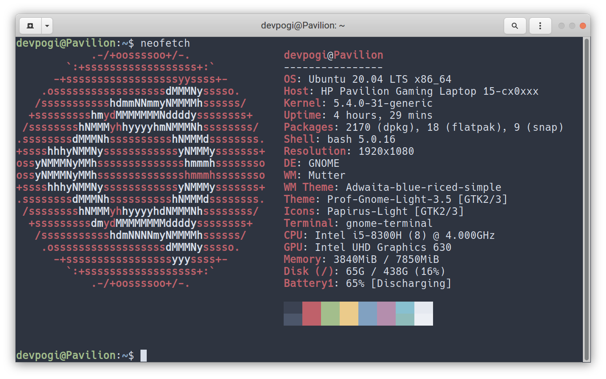

# Linux ricing

> The old configs have been moved [here.](https://github.com/devprabal/rice/blob/master/old/README.md)

> Most of the setups/tricks/configs/extensions/tweaks from the old still do work.

> If you are new to ricing, I suggest you to start by implementing/reading the old [`README.md`](https://github.com/devprabal/rice/blob/master/old/README.md) file because most of the new setups have been taken from the old and built/modified upon it or are a minimal version of the old with new workflow styles.

---

However, I am setting up fresh installs and setups on my *Pavi* (Pavilion15 cx0140tx).


*About Pavi, by [neofetch](https://github.com/dylanaraps/neofetch)*


The sections below deals mainly with the workflow and newly learned things/apps/concepts - 

For appearance, look and theming of these apps or the desktop, see [appearance.md](appearance.md)

---

### `conda init` command, if not using bash

If your **$SHELL** `echo $SHELL`  is not  bash, then the conda package manager (of anaconda) may not get initiated for that particular shell, say for example zsh.

conda, by default, places its initialization script in `~/.bashrc`.

So `conda` in zsh will say `zsh: command not found: conda`.

**Workaround** - 

DO NOT source `.bashrc` at the end of `.zshrc` because I have found it makes zsh loading slow.

You can open a bash session in zsh by typing `$ bash` and then run conda commands. 

OR (recommended)

`conda init zsh`

See `conda init --help`  for more.

---

### Deactivate auto-start of conda on launching a terminal

If you'd prefer that conda's base environment not be activated on startup, set the **auto_activate_base** parameter to false:

`conda config --set auto_activate_base false`

---

### VSCode sync

Settings, configurations, extensions for VSCode is synced by the following VSCode extension -

[Settings sync](https://marketplace.visualstudio.com/items?itemName=Shan.code-settings-sync)

It saves your settings, etc. in your github gist from which they can be downloaded on a new system or fresh install.

---

### Zathura

A minimal and vim-like pdf viewer which is light and extremely configurable.

The configuration file for zathura has to be set up in `~/.config/zathura/` as `zathurarc` which is a plain text file which is read by zathura line by line (# comment lines ignored). 

The documentation provides ways to set up colors, window sizes, etc.

See [documentation - zathura](https://pwmt.org/projects/zathura/documentation/)

See [documentation - girara, where you can set window sizes, etc.](https://pwmt.org/projects/girara/options/)

[my configuration](dotfiles/zathurarc)

---

### Commandline 

I have written some frequently used and important (and easily forgettable) commands [here](commandline.md).

---

### Anki 

Still not used, just installed. 

---

### Celluloid 

I was installing [mpv](https://github.com/mpv-player/mpv-build) from git-master but couldn't. 

Somehow, I stumbled upon gnome-mpv, now renamed to celluloid, which is a GTK+ frontend of mpv, built on mpv. So, I installed that from flathub.

I have still not experimented/played-around with it. 

---

### bash scripts

Some basic bash commands and syntax to help create small scripts and which should be remembered.

```bash
#!/bin/bash
eval "echo 2.4+1 | bc"
echo "NO of arguments = $#"
if [ -e $1 ]
then 
echo yes
else
echo no
fi
if [ -z $2 ]
then echo empty
else echo not empty
fi
if [ "$3" = "" ]
then echo third positional arg empty
else
echo third positional arg not empty
fi
# head -n 12 hi.txt | tail -n $(( 12 -5+1 )) 5 to 12 lines
var1=$(which python3)
if [ "$var1" != "" ]
then echo found; echo $var1
else
echo notfound
fi
dialog --backtitle "back" --title "title" --infobox "info" 10 20
echo -e "\033[0;31m fi"
read -p "enter" varname
echo $varname
### getopts command
while getopts ":ht" opt; do
  case ${opt} in
    h ) # process option h
    echo h
      ;;
    t ) # process option t
    echo t
      ;;
    \? ) echo "Usage: cmd [-h] [-t]"
      ;;
  esac
done
```

For a good and comprehensive study, read the website [ryanstutorial](https://ryanstutorials.net/bash-scripting-tutorial/)

---

### 
