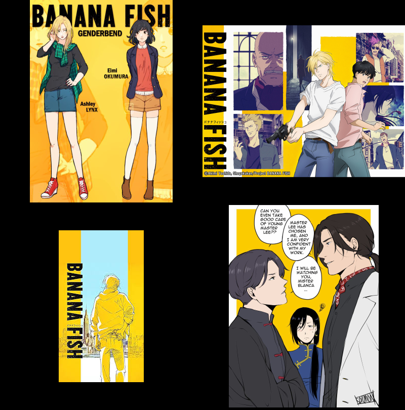

# Banana Fish Color Scheme

*[Banana Fish](https://anilist.co/anime/100388/BANANA-FISH/) is one of my favourite animes that inspired me to create a color scheme out of it.*

## Description of the colors

|  Color  |   HEX   |                      Description                      |
|:-------:|:-------:|:-----------------------------------------------------:|
|  Black  | #141415 |             Anime's main theme color (2/3)            |
|   Red   | #ED6E5B |                   Eiji's shirt color                  |
|  Green  | #16BF94 |                       Ash's eye                       |
|  Yellow | #FBD100 |             Anime's main theme color (1/3)            |
|   Blue  | #648CF5 |                    Yut Lung's dress                   |
| Magenta | #BD6DAB |           Shorter's Hair pale (from poster)           |
|   Cyan  | #AEECFB | Ash's sky blue shirt or the sky from alternate poster |
|  White  | #FCFCFC |             Anime's main theme color (3/3)            |

## Ports

**This is a WIP**, and hopefully, I will apply this color scheme to more programs that I use on a daily basis. For now, the color scheme is applied to the following programs -  

- [x] [gnome-shell-theme (3.36)](https://github.com/devprabal/Adwaita-bananafish)
- [x] [alacritty](../../dotfiles/config/alacritty/bananafish_color.yml)
- [ ] gtk-3.0
- [ ] vim
- [ ] VSCode
- [ ] gedit
- [ ] firefox
- [ ] telegram
- [ ] gnome-terminal

It is basically a dark color scheme and I have no idea if I will make a light color scheme or not.

## Inspiration

- See individual images [here](https://mega.nz/folder/28IAFaxZ#rRG5x3X7b1hp_2ptG4IcLA)
- See other beautiful arts and end quotes (iykwim :wink:) [here](https://mega.nz/folder/aoRiRISA#LYnnURIXnc3XfOqGX09mSg).

---

:pencil: NOTE: The color scheme uses the bright variants for the dim ones, and as such has only 8 colors in order to keep colors to a minimum. However, at times, more than one shades for black and white are used.
