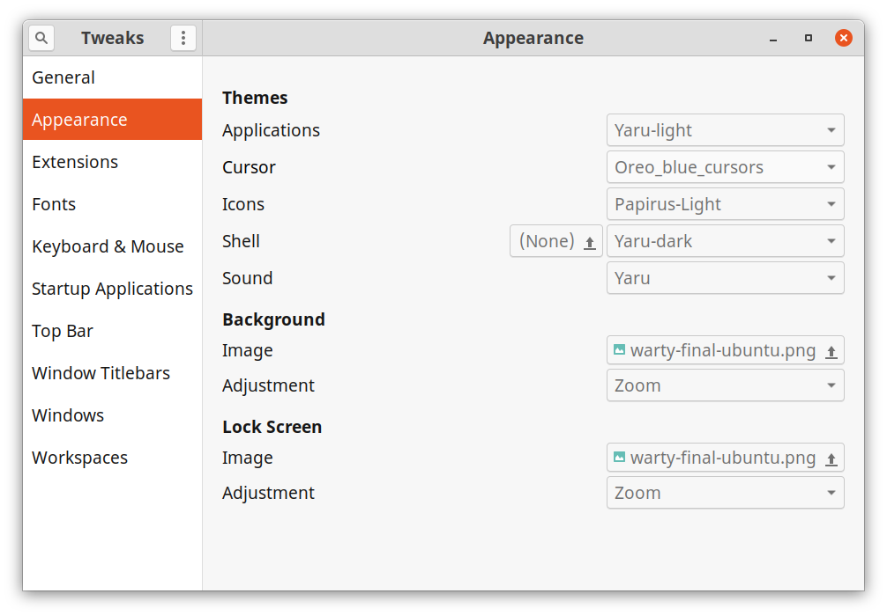
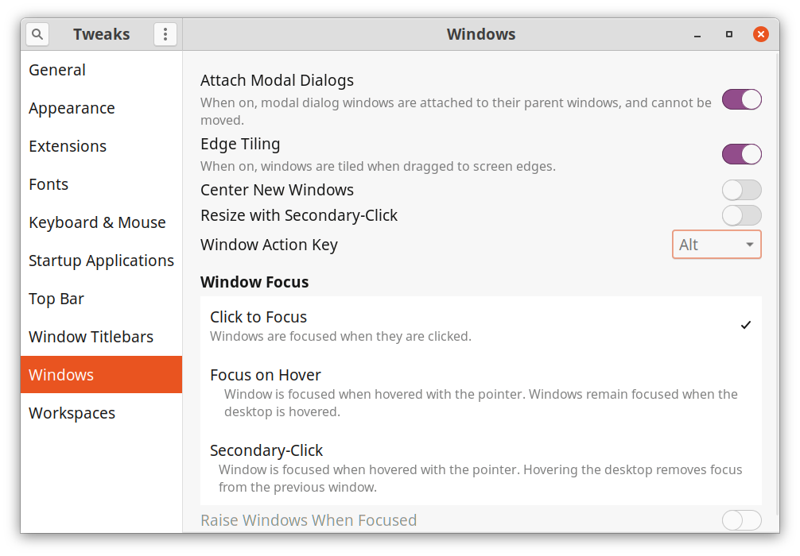
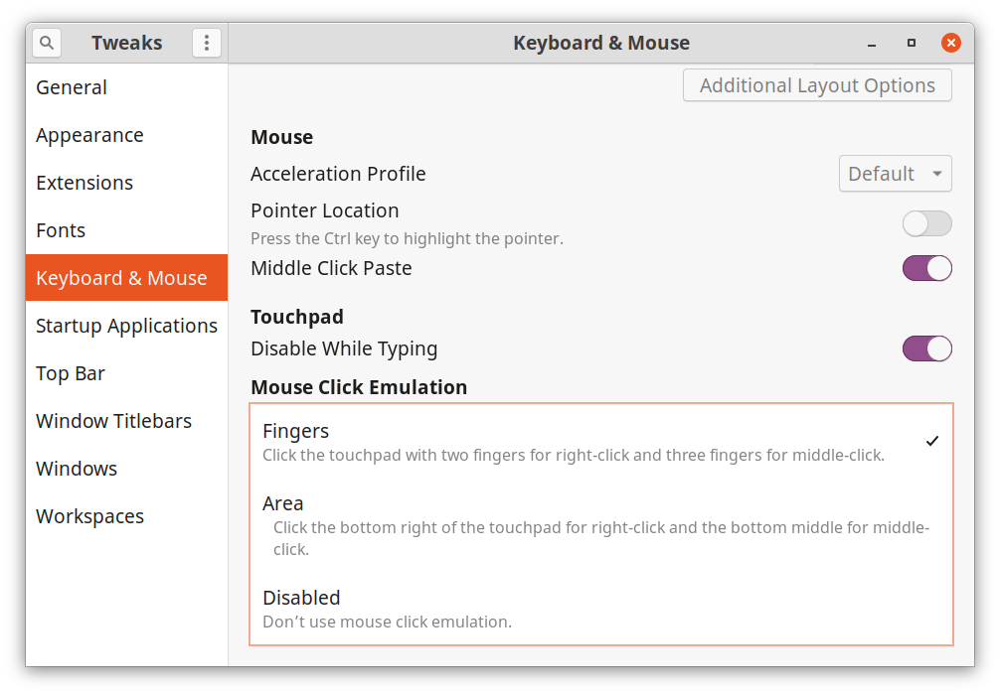

### gnome-tweaks screenshots 

Some necessary (for my Pavi) configs are shown in the screenshots below -

**Other settings for Title bar, top bar, etc. are trivial and can be done at the time when configuring the above settings.**
